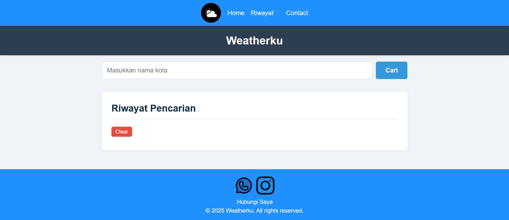
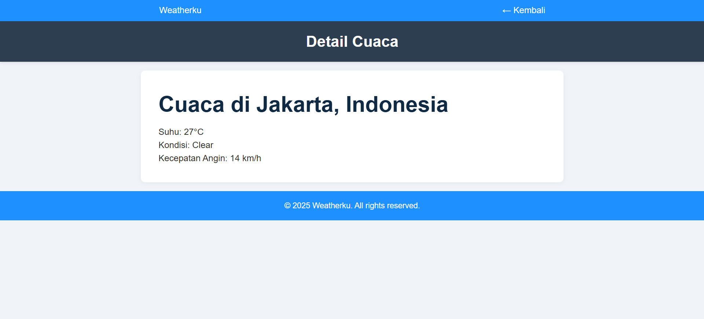

# Weatherku - Aplikasi Cuaca Sederhana

Weatherku adalah aplikasi web sederhana yang memungkinkan pengguna untuk mencari dan melihat informasi cuaca terkini dari berbagai kota di seluruh dunia. Aplikasi ini dibangun menggunakan HTML, CSS, dan JavaScript modern (ES Modules). Untuk mengambil data cuaca, aplikasi ini menggunakan fungsi *serverless* (API route) yang di-hosting di Vercel untuk berkomunikasi dengan API dari Weatherstack.

## Fitur Utama

- **Pencarian Cuaca**: Cari informasi cuaca berdasarkan nama kota.
- **Tampilan Cuaca Terkini**: Menampilkan informasi penting seperti suhu, kondisi cuaca (misalnya, "berawan"), dan ikon cuaca yang relevan.
- **Detail Cuaca**: Halaman khusus untuk melihat detail lebih lanjut seperti suhu yang dirasakan, kelembapan, dan kecepatan angin.
- **Riwayat Pencarian**: Menyimpan 10 kota terakhir yang dicari untuk akses cepat.
- **Akses Riwayat**: Klik pada item di riwayat untuk langsung melihat kembali cuaca di kota tersebut.
- **Desain Responsif**: Tampilan yang dapat menyesuaikan diri dengan berbagai ukuran layar.

## Tampilan Aplikasi


**Halaman Utama:**


**Halaman Detail:**


## Teknologi yang Digunakan

- **Frontend**:
  - HTML5
  - CSS3
  - JavaScript (ES Modules)
- **Backend (Serverless)**:
  - Vercel Serverless Functions (Node.js)
- **API**:
  - [Weatherstack API](https://weatherstack.com/) untuk mendapatkan data cuaca.

## Struktur Proyek

Proyek ini diorganisir dengan struktur yang bersih dan modular untuk kemudahan pengembangan dan pemeliharaan.

```
wether-app/
├── api/                # Folder untuk serverless function (proxy api)
│   └── weather.js      # proxy API ke Weatherstack
├── assets/
│   └── icons/          # Ikon dan gambar
├── css/
│   └── style.css       # Styling untuk seluruh aplikasi
├── js/
│   ├── api.js          # Mengelola semua permintaan ke OpenWeatherMap API
│   ├── storage.js      # Mengelola penyimpanan riwayat di localStorage
│   ├── ui.js           # Mengelola semua pembaruan antarmuka (DOM)
│   └── main.js         # Titik masuk utama, mengikat semua modul
├── index.html          # Halaman utama aplikasi
├── detail.html         # Halaman untuk menampilkan detail cuaca
└── README.md           # File ini
```

### Penjelasan Modul JavaScript

- **`api.js`**: Bertanggung jawab untuk berkomunikasi dengan server OpenWeatherMap. Fungsi utamanya adalah mengambil data cuaca berdasarkan nama kota.
- **`storage.js`**: Berfungsi untuk menyimpan dan mengambil data riwayat pencarian dari `localStorage` browser.
- **`ui.js`**: Berisi fungsi-fungsi untuk merender atau menampilkan data (seperti kartu cuaca dan daftar riwayat) ke dalam HTML.
- **`main.js`**: Bertindak sebagai "otak" aplikasi. Modul ini menginisialisasi aplikasi, menangani input dari pengguna (seperti pencarian dan klik), dan mengoordinasikan interaksi antara modul `api`, `storage`, dan `ui`.

## Instalasi dan Penggunaan

Untuk menjalankan proyek ini di komputer lokal Anda, ikuti langkah-langkah berikut:

1.  **Clone Repositori** (jika sudah ada di Git)
    ```bash
    git clone https://github.com/username/wether-app.git
    cd wether-app
    ```
2.  **Dapatkan Kunci API**
    - Buat akun gratis di OpenWeatherMap.
    - Buka halaman "API keys" di dasbor akun Anda dan salin kunci API Anda.

3.  **Masukkan Kunci API**
    - Buka file `js/api.js`.
    - Ganti nilai `const API_KEY` dengan kunci API yang telah Anda salin.

4.  **Jalankan Aplikasi**
    - Buka file `index.html` langsung di browser Anda.

### Permasalahan: Berjalan di Live Server, tetapi gagal di Vercel

Saat pengembangan lokal menggunakan **Open with Live Server** (atau environment localhost), aplikasi cuaca ini dapat berjalan normal. Namun, setelah dideploy ke **Vercel**, muncul masalah: data cuaca tidak bisa ditampilkan dan hanya menampilkan pesan error seperti:

```
Gagal mengambil data cuaca: load failed
```

#### Penyebab Utama

* **Weatherstack API (Free Plan)** hanya menyediakan endpoint **HTTP**, bukan HTTPS.
* Website yang dihosting di **Vercel** sudah menggunakan **HTTPS** secara default.
* Browser modern **tidak mengizinkan mixed content** (yaitu melakukan request dari HTTPS ke HTTP), sehingga request dari website ke Weatherstack diblokir ketika diakses melalui Vercel.

#### Solusi

Untuk mengatasi masalah ini, dibuat **proxy API** menggunakan **Serverless Function di Vercel**.
Proxy ini bertugas:

1. Menerima request dari frontend melalui route `/api/weather`.
2. Meneruskan request tersebut ke Weatherstack API (HTTP).
3. Mengirimkan kembali data JSON cuaca ke frontend melalui HTTPS (aman).

#### Hasil

Dengan adanya proxy API:

* Aplikasi tetap bisa mengambil data dari Weatherstack.
* Website bisa berjalan normal baik di **Live Server (localhost)** maupun di **Vercel (HTTPS)**.
* API key lebih aman karena disimpan di sisi server, bukan langsung di frontend.

Contoh endpoint setelah deploy ke Vercel:

```
https://weatherku-eight.vercel.app/api/weather?city=Jakarta
```

Endpoint ini aman digunakan oleh frontend tanpa terkena masalah mixed content.


---

Dibuat oleh **Irgiharnoyo** &copy; 2025